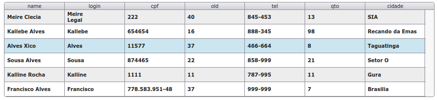

# xGrid
> @author Francisco Alves
> version **3.2**

> xGrid is a tool inspired by Delphi dbgrid, it facilitates web application development.



## Installation

```html
<script src="https://cdnjs.cloudflare.com/ajax/libs/jquery/3.2.1/jquery.js" type="text/javascript"></script>
<link href="css/xGrid_base.css" rel="stylesheet" type="text/css"/>
<script src="xGrid.js" type="text/javascript"></script>
```

**optional for example only**
```html
<script src="countries.js" type="text/javascript"></script>
```

## Usage simples
```html
<div id="pnGrid"></div>
```

```javascript
var xGrid = new xGrid({
          id:'#pnGrid',
          height: 300
});
```

## API ##

## Options
>-------------------------------------------
**width and height**
>Type: px; Default: 100%
```javascript
var xGrid = new xGrid({
          width: 300,
          height: 300
});
```

**heightLine**
>Type: px; Default: 30;
- line height
- altura da linha
```javascript
var xGrid = new xGrid({
          heightLine: 50
});
```

**lineFocus**
>Type: int; Default: null;
- when the json is loaded the line is selected
- ao finalizar o carregamento do json a linha é selecionada
```javascript
var xGrid = new xGrid({
          lineFocus: 50
});
```
**theme**
>Type: string; Default: x-gray;
- changes the layout of the xGrid completely. It is necessary to load the css referring to thema
- muda completamente o layout da xGrid. É necessario carregar o css referente ao thema
```javascript
var xGrid = new xGrid({
          theme: 'x-blue'
});
```

**count**
>Type: Boolean; Default: false;
- when true shows a column with a counter
- quando true mostra uma coluna com um contador
```javascript
var xGrid = new xGrid({
          count: true
});
```


## Methods
>-------------------------------------------

**focus**
>Type:int, parameter not required
- focuses on the last line selected, or the first.
- parameter select the desired line
- foca a última linha selecionada, ou a primeira.
- parametro selecionar a linha desejada
```javascript
xGrid.focus();
or
xGrid.focus(5);
```

**focusFirstRow**
- select the first line
- seleciona a primeira linha
```javascript
xGrid.focusFirstRow();
```


**focusField**
>Type:strintg, parameter not required
**requirement: sideBySide**
- focuses on the first 'input' field. Note the sideBySide must be enabled. To focus on another field just pass the name
- foca no primeiro campo 'input'. Obs o 'sideBySide' tem que estar abilitado. Para focar em outro campo basta passar o nome 
```javascript
xGrid.focusField();
or
xGrid.focusField('name_of_field_input');
```

**getIndex**
- returns the index of the selected row
- retorna o índex da linha selecionada
```javascript
xGrid.getIndex();
```

**deleteLine**
- delete selected row
- deleta linha selecionada
```javascript
xGrid.deleteLine();
```

**clearGrid**
- clears the xGrid data
- limpa os dados da xGrid
```javascript
xGrid.clearGrid();
```

**disable**
- Disables Grid
- desabilita a Grid
```javascript
xGrid.disable();
```

**enable**
- enable Grid
- habilita a Grid
```javascript
xGrid.enable();
```

**load**
>Type:string; Default: 'Carregando'; parameter not required
```javascript
xGrid.load();
```

**closeLoad**
- hide the load
- fecha o load
```javascript
xGrid.load();
```

**refresh**
- reloads xGrid data
- recarrega os dados da xGrid
```javascript
xGrid.refresh();
```
