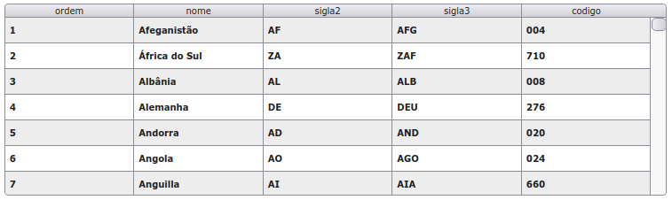

# xGrid
> @author Francisco Alves
> version **3.2**

> xGrid is a tool inspired by Delphi dbgrid, it facilitates web application development.



## Installation

```html
<link href="css/xGrid_base.css" rel="stylesheet" type="text/css"/>
<script src="xGrid.js" type="text/javascript"></script>
```

**optional for example only**
```html
<script src="../countries.js" type="text/javascript"></script>
```

## Usage simples
```html
<div id="pnGrid"></div>
```

```javascript
var xGrid = new xGrid({
          id:'#pnGrid',
          height: 300
});
```

## API ##

## Options
>-------------------------------------------
**width and height**
>Type: px; Default: 100%
```javascript
var xGrid = new xGrid({
          width: 300,
          height: 300
});
```

**heightLine**
>Type: px; Default: 30;
```javascript
var xGrid = new xGrid({
          heightLine: 50
});
```


```javascript
```
```javascript
```
```javascript
```
```javascript
```
```javascript
```
```javascript
```
```javascript
```
```javascript
```
